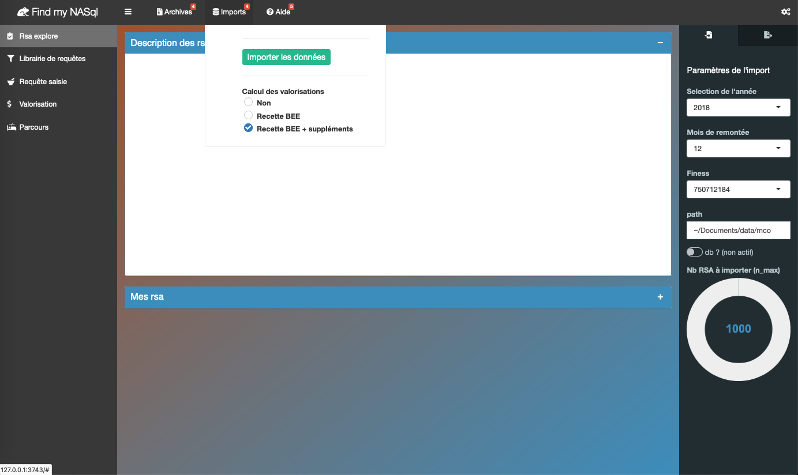
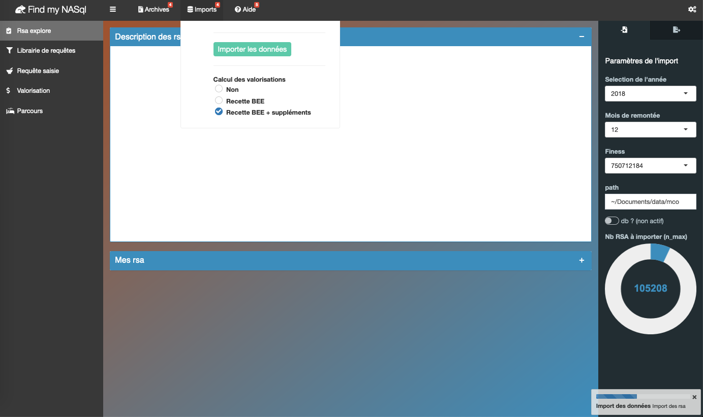
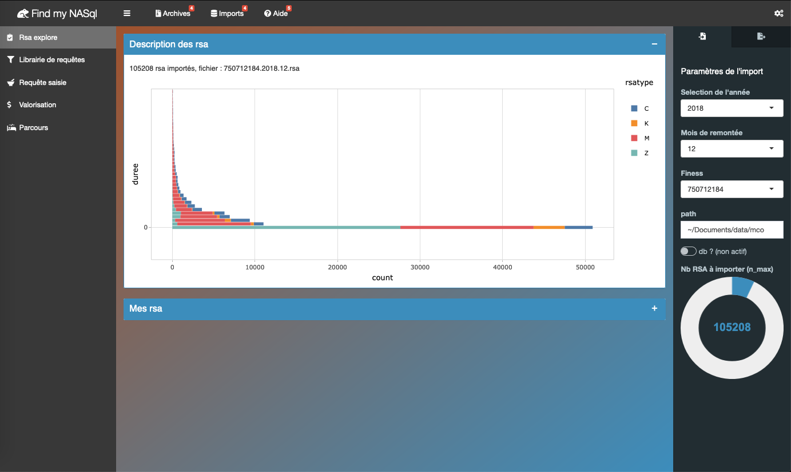
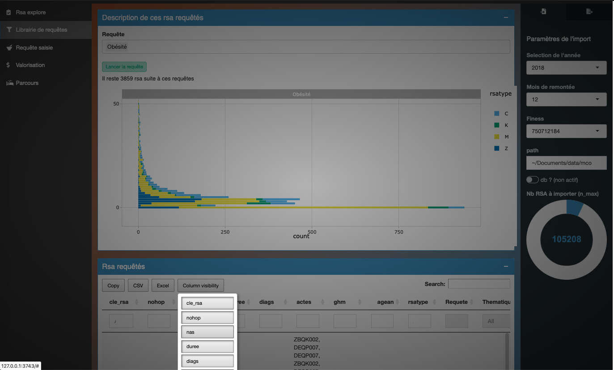
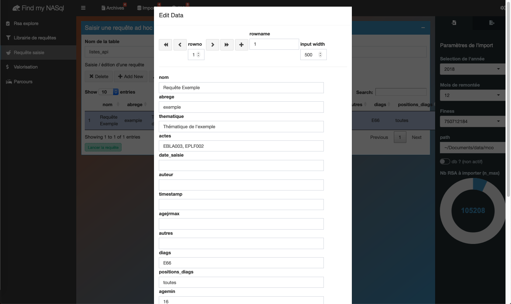
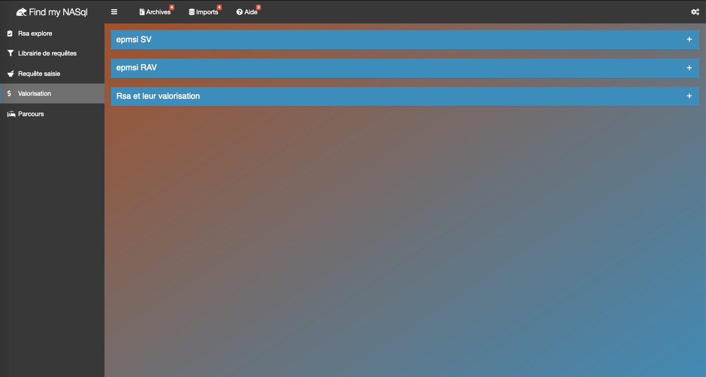
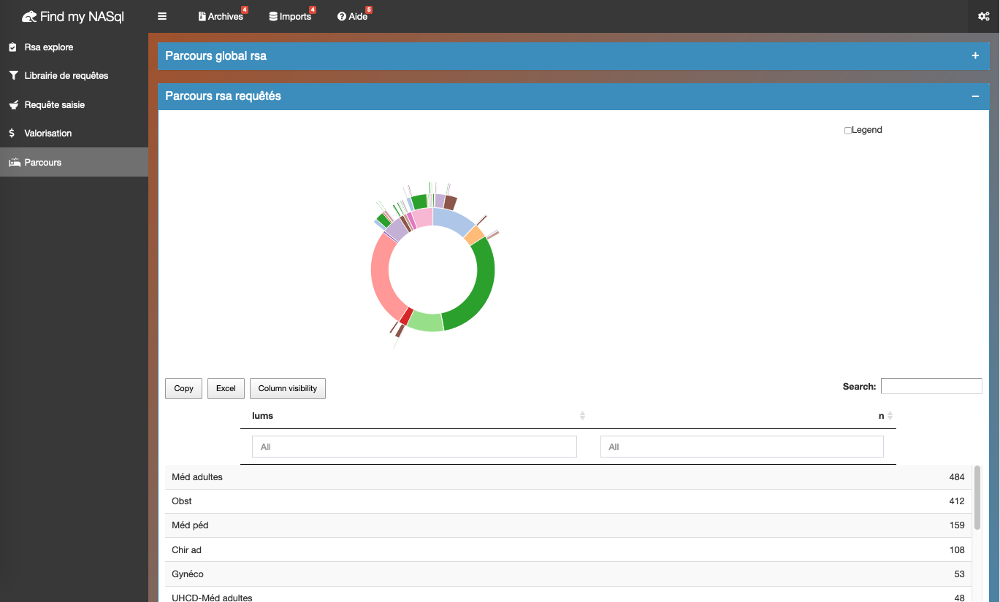
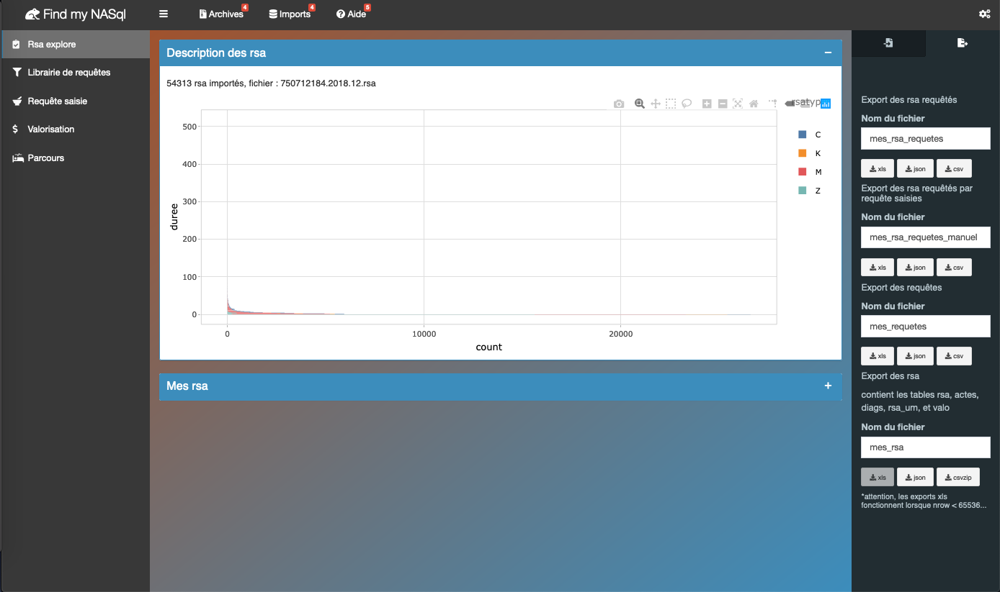

## brouillon d'app shiny pour importer et requêter les rsa sans programmer

##### Import des rsa facilité

##### Requêtage via la librairie de requêtes de nomensland

##### Requêtage via la saisie de requêtes

##### La valorisation des rsa, et un dégradé de couleurs en arrière plan

##### Les parcours au travers des types d'autorisation des unités médicales

##### Export des requêtes, des résultats des requêtes et des rsa aux formats xls, json et csv

